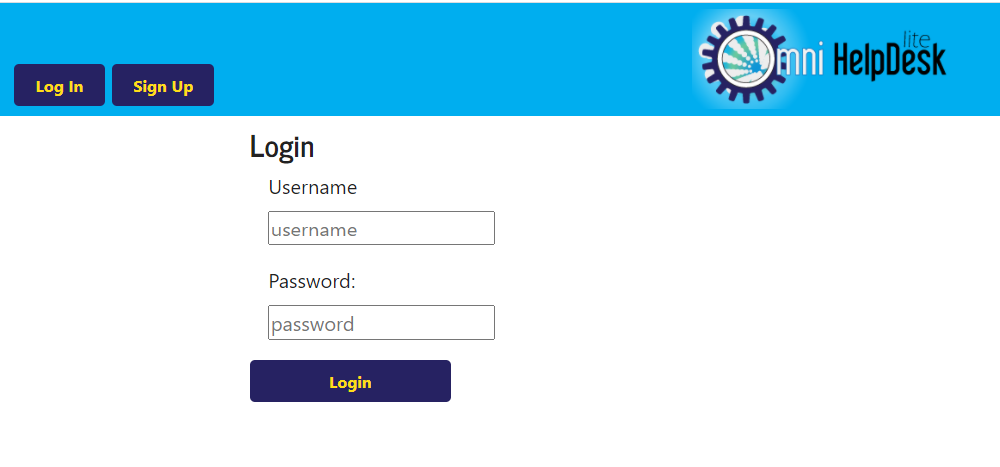
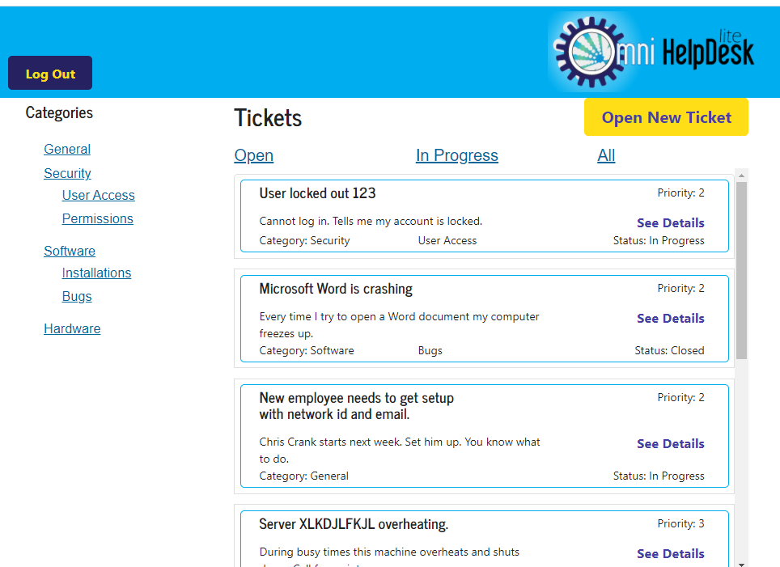
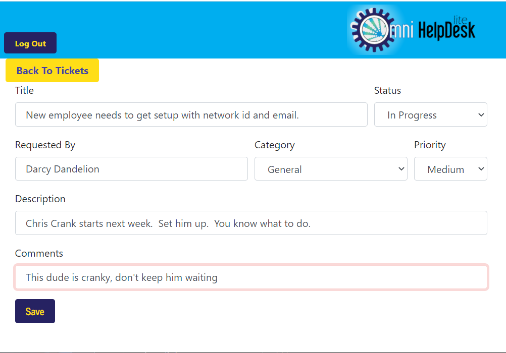

# Omni Helpdesk Lite   

## Bootcamp Final Project


As a developer, I’ve often had to wear many hats. One of these roles was that of IT Helpdesk Support.  Over the years, I have worked with several different ticket tracking applications and found all of them to have both good and bad features. Maybe someday I can build something with all of the good and none of the bad?

Omni Helpdesk Light is a simple and lightweight ticket tracking app that incorporates a few of my favorite features. The initial goal is to provide a clear, intuitive user interface and make tracking and managing support request tickets simple.

## User Story
AS A small business owner or helpdesk technician

I WANT to be able to manage helpdesk requests in a simple and intuitive way

SO THAT I can prioritize and focus on tasks


## Technologies
MongoDB, Express Web Server, ReactJS, Node, Passport, react-bootstrap, react-card-list, dotenv, bcryptjs, connect-mongodb-session

## Installation

To install the required dependencies, run `npm install`

This package assumes there is a MongoDB server running on localhost:27017. If your server is running somewhere else, you can edit `.env` to reflect that.

## Usage

#### for Development

Start the client
```bash
npm run dev
```

Start the server
```bash
npm start
```

#### for Production

```bash
npm run build
npm start
```

## Example Usage

Deployed App: https://peaceful-chamber-39883.herokuapp.com/


An example screenshots of the application is below.







